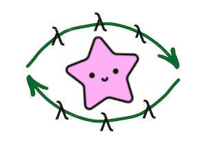

# context_fp_gleam

[](https://hex.pm/packages/context_fp_gleam)
[](https://hexdocs.pm/context_fp_gleam/)



Functional programming context for Gleam

```sh
gleam add context_fp_gleam
```

## Features

- 💉 Dependency injection without magic, only functions
- 🤌 Functions cached during workflow, no excess cost of CPU
- 💡 Smart type inference via generics
- ♻️ Unit tests friendly, feel free to pass mocked function in the Context

## How to

#### Basic example

```gleam
import context_fp_gleam.{cfp2}

let positive_numbers = fn(ns, _c) { list.filter(ns, fn(n) { n > 0 }) }
let numbers_prefix = fn(_ns, _c) { "Here is numbers: " }
let positive_numbers_as_string = {
  use ns, prefix, _c <- cfp2(positive_numbers, numbers_prefix)
  prefix
  <> list.map(ns, fn(n) { int.to_string(n) })
  |> string.join(",")
}

// Here is numbers: 7,4
positive_numbers_as_string([-1, -5, 7, 0, 4], dict.new())
```

#### Calculations cached example

```gleam
import context_fp_gleam.{cfp1,cfp2}

let positive_numbers = fn(ns, _c) {
  list.filter(ns, fn(n) { n > 0 }) // will be called only once
}
let positive_numbers_length = {
  use ns, _c <- cfp1(positive_numbers)
  list.length(ns)
}
let positive_numbers_as_string = {
  use ns, length, _c <- cfp2(positive_numbers, positive_numbers_length)
  list.map(ns, fn(n) { int.to_string(n) })
  |> string.join(",")
  <> "; length - "
  <> int.to_string(length)
}

// 7,4; length - 2
positive_numbers_as_string([-1, -5, 7, 0, 4], dict.new())
```

#### Dependency injection example

```gleam
import context_fp_gleam.{cfp1}

let fetch_user_from_db = fn(_ctx, _c) { User("Petya") }
let fetch_user = fn(fetch_user_mock, _c) {
  option.unwrap(fetch_user_mock, fetch_user_from_db)()
}
let hello_world_user = {
  use user, _c <- cfp1(fetch_user)
  "Hello world, " <> user.name
}

// Hello world, Vasya
hello_world_user(option.Some(fn() { User("Vasya") }), dict.new())
```

#### Extract cache for DB transaction example

```gleam
import context_fp_gleam.{cfp1}

let fetch_user_from_db = fn(id, _c) {
  case id {
    1 -> option.Some(User(1, "Petya", 30))
    _ -> option.None
  }
}
let user_birthday = {
  use user, _c <- cfp1(fetch_user_from_db)
  option.map(user, fn(user) { User(..user, age: user.age + 1) })
}
let save_to_db = {
  use _, cache <- cfp1(user_birthday)
  let db_entities = dict.values(cache)
  let queries =
    list.flat_map(db_entities, fn(user) {
      case dynamic.unsafe_coerce(user) {
        option.Some(User(_, _, _) as user) -> [
          #("update users set age = $1 where id = $2; ", [user.age, user.id]),
        ]
        _ -> []
      }
    })
  let transaction_sql = case list.length(queries) > 0 {
    True ->
      list.fold(queries, "begin; ", fn(acc, query) { acc <> query.0 })
      <> "commit;"
    False -> ""
  }
}
save_to_db(1, dict.new())
```

## See also

- [context-fp](https://github.com/darky/context-fp) - Functional programming context for TypeScript
- [context-fp-go](https://github.com/darky/context-fp-go) - Functional programming context for Golang
